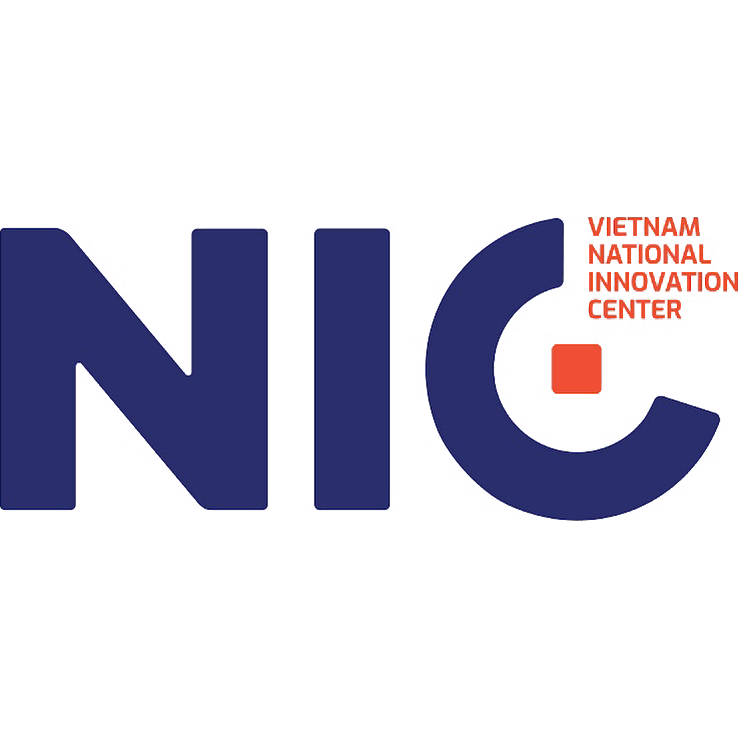
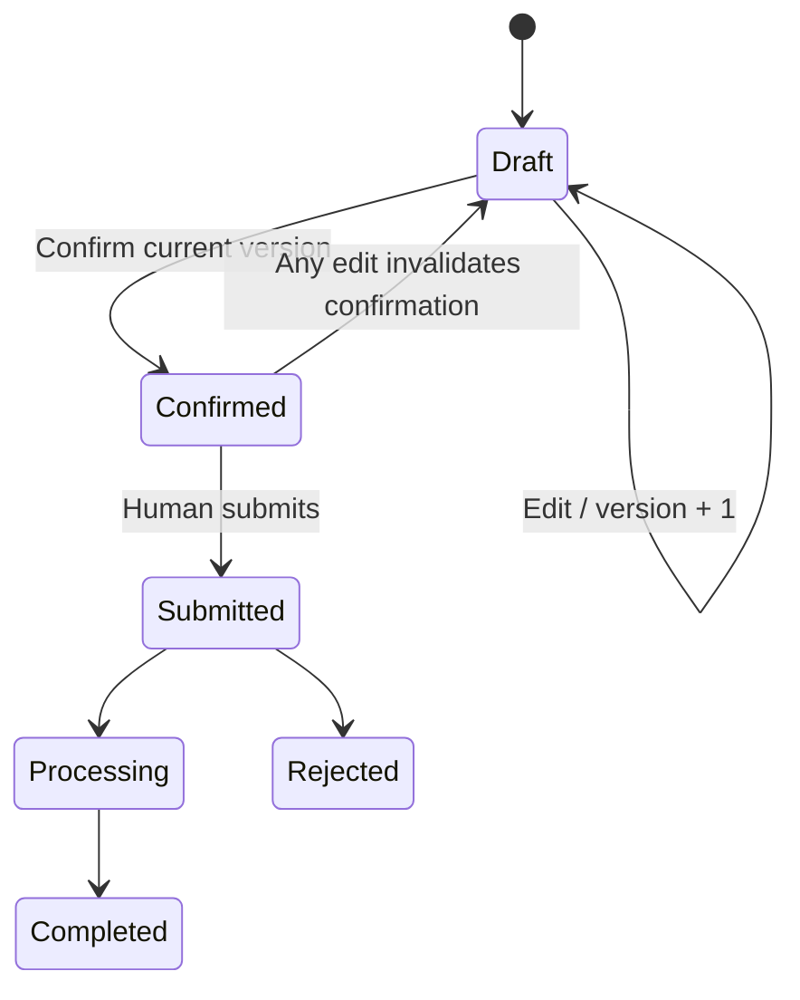
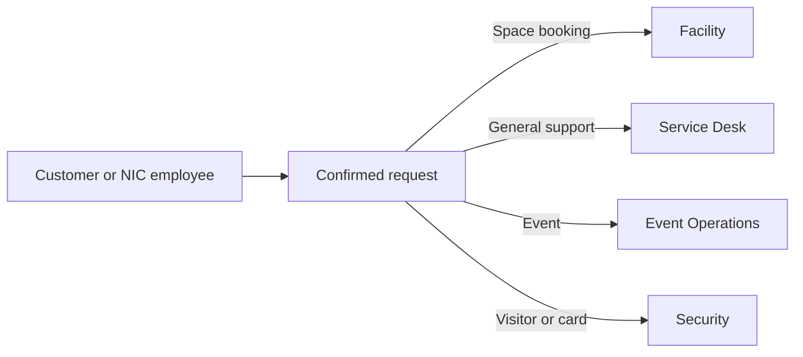
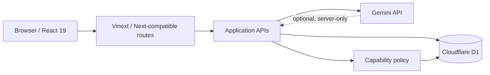

<div align="center">

  

  # NIC Service Hub — AI-Powered Facility & Visitor Services

  **Cổng dịch vụ ERP dành cho doanh nghiệp, khách và đội vận hành tại NIC: tiếp nhận yêu cầu cơ sở vật chất, đặt không gian, đăng ký sự kiện/khách/thẻ ra vào và hỗ trợ người dùng bằng NIC Copilot.**

  
  
  
  
  

  [Private demo](https://nic-service-hub.ntt-121020.chatgpt.site) · [Technical documentation](docs/README.md) · [Current handoff](docs/CODEX_HANDOFF.md)
</div>

---

## Table of Contents

- [1. Overview & Requirements Coverage](#1-overview--requirements-coverage)
- [2. Product Capabilities](#2-product-capabilities)
- [3. Roles & Authorization](#3-roles--authorization)
- [4. Architecture & Data Model](#4-architecture--data-model)
- [5. AI Copilot](#5-ai-copilot)
- [6. Local Setup](#6-local-setup)
- [7. Testing & Evaluation](#7-testing--evaluation)
- [8. Deployment & Demo](#8-deployment--demo)
- [9. Security](#9-security)
- [10. Limitations & Roadmap](#10-limitations--roadmap)
- [11. Repository Structure](#11-repository-structure)
- [12. Documentation](#12-documentation)

---

## 1. Overview & Requirements Coverage

### Problem

Companies working at or visiting NIC need a single place to:

- request facility and technical support;
- reserve workspaces and event spaces;
- register visitors and access cards;
- coordinate event services and logistics;
- track request status across NIC operational teams;
- ask questions about NIC facilities and services in natural language.

Without a shared workflow, information is fragmented across chat, email and manual spreadsheets. Requests can miss ownership, status, SLA and audit evidence.

### Solution

NIC Service Hub combines three product surfaces:

1. **Public service portal** — explains NIC services and routes users to registration or sign-in.
2. **Authenticated ERP workspace** — creates, confirms, submits and tracks service requests with organization and department scope.
3. **NIC Copilot** — understands Vietnamese requests, retrieves controlled guidance and opens the correct service form. AI can prepare; only a human can confirm and submit.

> Core principle: **ERP governs; AI prepares; users decide; the backend executes.**

### Requirements coverage

The table is intentionally honest: UI prototypes are not counted as completed operational automation.

| Brief requirement | Status | Current evidence | Remaining work |
|---|---|---|---|
| AI-powered assistant | **Implemented foundation** | Multi-turn Copilot, database-backed versioned knowledge retrieval, capacity lookup, optional Gemini API and structured output | Configure production API secret; add hybrid/vector retrieval and evaluation set |
| Receive facility/maintenance requests | **Implemented (MVP)** | Dedicated support form; draft → confirm → submit; audited persistence; automatic triage work order; scoped comments, timeline and cancellation | Attachments and production field evidence |
| Support companies during NIC visits/work | **Implemented (MVP)** | Customer portal, request tracking, booking/event/access forms, QR check-in and badge jobs | Production device/controller integration |
| Coordinate building service providers | **Implemented (MVP)** | Provider directory, assignment, response history, acknowledgment/confirmation and SLA escalation | Production provider connector and supplier self-service |
| Schedule repairs | **Implemented (MVP)** | Maintenance work orders, preventive plans, internal/provider assignment, technician calendar, SLA and lifecycle | Production cron scheduling and field evidence |
| Catering / tea-break requests | **Implemented (MVP)** | Structured packages, servings, event date, versioned pricing snapshot, provider assignment and lifecycle | Supplier self-service portal |
| Event logistics | **Implemented (MVP)** | Versioned template, dependency checklist, equipment/service lines, budget approval and audit | Production catalog enrichment |
| Workspace reservations | **Implemented (MVP)** | Space catalog, booking ledger, capacity validation and database anti-overlap | Approval policy and recurring bookings |
| Visitor registration | **Implemented (MVP)** | Visitor/host record, one-time QR, access zones, badge print/reprint, check-in/out and offline-safe hold | Production printer/controller adapters |
| Facility/service information | **Implemented foundation** | Active, versioned database knowledge documents, ranked retrieval and constrained citations | Editorial workflow, hybrid/vector retrieval and evaluation |
| Cross-team ERP authorization | **Implemented (MVP)** | Capability grants, department queues, maker-checker, SLA escalation, operations dashboards and audited APIs | Production identity and periodic policy review |

### Current maturity

This repository is a **working MVP/prototype**, not a production-complete facility ERP. P1 operational reliability and P2 asset/cost/event/visitor/master-data/analytics workflows are implemented with backend authorization, audit and database invariants. Runtime observability now includes correlation IDs and protected stack-frame diagnostics. Production secrets/schedules, external telemetry export, real device adapters, supplier self-service and identity hardening remain roadmap items.

---

## 2. Product Capabilities

### Public experience

- NIC-branded public homepage at `/`.
- Service overview and operating process.
- Explicit routes to `/auth` and `/auth?mode=register`.
- Responsive layout using self-hosted Be Vietnam Pro fonts.

### Authentication

- Account registration and seeded demo account.
- PBKDF2-SHA256 password derivation with random salt and 210,000 iterations.
- HttpOnly session cookie and separate CSRF token.
- Account lockout after repeated failed sign-in attempts.
- Revoke-all-sessions action.

### Customer service workflow

Four dedicated service forms:

| Service | Structured fields | Routed team |
|---|---|---|
| Workspace/room booking | Date, start/end time, capacity, space type, purpose | Facility |
| Operational support | Category, priority, location, desired date, description | Service Desk |
| Event registration | Event, date, participants, attendee role, notes | Event Operations |
| Visitor/access card | Request type, holder, contact, effective date, reason | Security |

Every request follows:



Submit requires ownership, the current confirmed version and an idempotency key. Request creation and audit insertion run through the backend.

### Portal routes

| Route | Purpose |
|---|---|
| `/portal` | Customer workspace and common services |
| `/portal/requests` | Scoped request search, detail, two-way comments, audit timeline and policy-based cancellation |
| `/portal/bookings` | Real space catalog, booking form and personal booking ledger |
| `/portal/operations` | Service Desk/Facility queue, assignment, status, booking agenda and work orders |
| `/portal/coordination` | Visitor registration/check-in and event/catering coordination |
| `/portal/reliability` | SLA automation, provider response, resource scheduling and access review |
| `/portal/portfolio` | Asset/PM, cost, event template, visitor device, master data and analytics P2 |
| `/portal/procurement` | Contract, PO approval, receipt, invoice and three-way match P3 |
| `/portal/diagnostics` | Protected runtime error reports with function, source file, line and column |
| `/portal/help` | Help center and Copilot entry point |

---

## 3. Roles & Authorization

Authorization is capability-based. A role is a reusable capability bundle; the backend also checks organization, department, ownership, assignment and record state.

| Role | Data scope | Main capabilities |
|---|---|---|
| `customer_member` | Own records | Create requests/bookings/visitors; track own requests |
| `customer_admin` | Customer organization | Member capabilities plus organization request view and member management |
| `service_desk` | Service Desk queue | Triage, route and update assigned-team requests |
| `facility_staff` | Facility queue/assignments | Process facility requests and work orders |
| `facility_manager` | Facility department | Assignment, escalation and reporting |
| `event_staff` / `event_manager` | Event queue | Event preparation and logistics scope |
| `security_staff` | Security queue | Visitor, card and access processing |
| `system_admin` | Explicit admin capabilities | Access/configuration management; no AI-driven business submission |
| `auditor` | Read-only authorized scope | Audit and report inspection |

Requests are routed by service type:



Customer users cannot assign providers, approve requests, change SLA, inspect another tenant or access internal operations queues.

See [identity and access control](docs/identity-access-control.md) and [role-based layouts](docs/role-based-layouts.md).

---

## 4. Architecture & Data Model

### Runtime architecture



- **Frontend:** React 19, TypeScript, Vinext/Vite and Tailwind CSS 4.
- **Backend:** Next-compatible API route handlers deployed as a Cloudflare Worker.
- **Persistence:** Cloudflare D1/SQLite for the deployed MVP; Drizzle schema and SQL migrations.
- **AI:** Gemini API with `gemini-2.5-flash` and structured outputs; deterministic local fallback.
- **Target architecture:** modular monolith, with UI → application/domain → persistence boundaries.

### Core data entities

| Entity | Purpose |
|---|---|
| `users` | Identity and password derivation metadata |
| `sessions` | Hashed session and CSRF state |
| `departments` | Request-receiving operational teams |
| `organization_memberships` | User role and department within an organization |
| `service_drafts` | Editable, versioned requests before submission |
| `service_requests` | Official submitted request, routing, assignment and visibility |
| `request_comments` | Two-way request discussion linked to actor and official request |
| `audit_logs` | Security and workflow audit events |
| `rate_limits` | Distributed write/login rate-limit buckets |

### Database migrations

Migrations are stored in `drizzle/`:

- `0000` — users, sessions and initial service drafts;
- `0001` — service requests and audit logs;
- `0002` — CSRF session data and distributed rate limits;
- `0003` — departments, memberships and cross-team request routing.
- `0011` — request comments and request-time index for customer/operator collaboration.

---

## 5. AI Copilot

### Supported behavior

- Understand Vietnamese natural-language requests and minor spelling variation.
- Keep the latest eight conversation turns as context.
- Identify the relevant service type.
- Retrieve active, versioned knowledge documents from the database and return constrained citations.
- Check suitable room capacity when the request includes a participant count.
- Ask one clarification question when necessary.
- Open the corresponding service form for the user to review.

### Guardrails

The AI capability allowlist is intentionally limited to equivalents of:

```text
search_knowledge
check_availability
create_request_draft
```

There is no `submit_request` capability. The model cannot approve, assign, submit or directly write an official request. Structured Outputs limit responses to an answer, source labels and an optional suggested service.

### Runtime modes

1. **Gemini mode:** enabled when `GEMINI_API_KEY` exists at server runtime. The default model is `gemini-2.5-flash` and can be configured through `GEMINI_MODEL`.
2. **Local fallback:** accent-insensitive Vietnamese normalization, recent-context aggregation and intent scoring. It keeps the portal usable without an API key but is not equivalent to a full language model.

Current production limitation: without `GEMINI_API_KEY`, the deployment uses the deterministic grounded fallback. Both modes use the same retrieved knowledge and preserve the no-submit guardrail.

---

## 6. Local Setup

### Prerequisites

- Node.js `>=22.13.0`
- npm

### Install

```bash
git clone <repository-url>
cd NIC-AI
npm ci
```

### Environment

Create `.env.local` from the committed example:

```bash
copy .env.example .env.local
```

On macOS/Linux:

```bash
cp .env.example .env.local
```

Variables:

| Variable | Required | Description |
|---|---|---|
| `GEMINI_API_KEY` | Optional | Server-only key enabling language-model understanding |
| `GEMINI_MODEL` | Optional | Model override; defaults to `gemini-2.5-flash` |

Never commit `.env.local`, API keys or service-role credentials.

### Run

```bash
npm run dev
```

The dev command applies pending local D1 migrations and starts the app at [http://localhost:3000](http://localhost:3000).

### Demo accounts

```text
Email:    thanh@demo.nic.vn
Password: Demo@12345
Role:     customer_admin
Org:      Innovate Vietnam
```

This account is test data only.

Operational accounts use the same test password:

| Email | Role | Landing route |
|---|---|---|
| `desk@demo.nic.vn` | `service_desk` | `/portal/operations` |
| `facility@demo.nic.vn` | `facility_manager` | `/portal/operations` |
| `event@demo.nic.vn` | `event_manager` | `/portal/coordination` |
| `security@demo.nic.vn` | `security_staff` | `/portal/coordination` |

### Useful commands

| Command | Purpose |
|---|---|
| `npm run dev` | Apply local migrations and start development server |
| `npm run build` | Create deployable Vinext build |
| `npm run lint` | Run ESLint |
| `npm run test:unit` | Run policy/security/isolation tests |
| `npm test` | Unit tests, production build and rendered HTML test |
| `npm run db:generate` | Generate Drizzle migration from schema changes |
| `npm run db:local:migrate` | Apply migrations to the local D1 state |

---

## 7. Testing & Evaluation

Current verified baseline: **55 automated checks passing** (54 unit/integration and 1 rendered-page test).

| Test area | Evidence |
|---|---|
| Password storage | Schema does not store plaintext passwords; demo hash verification |
| Session security | HttpOnly, SameSite, SHA-256 token hash and CSRF checks |
| Request integrity | Ownership, version confirmation and idempotency |
| Tenant isolation | Two-organization SQLite integration scenario |
| ERP authorization | Membership, department routing and capability policy checks |
| Operations workflow | Request/work-order transitions, scoped assignment and audit requirements |
| Booking integrity | Capacity checks and overlap rejection against migrated SQLite schema |
| AI safety | No submission capability or direct official-request insert |
| Public navigation | Home routes explicitly to login and registration |
| Rendering | Production worker renders public NIC homepage without local file URLs |

Run the complete suite:

```bash
npm test
```

Not yet measured:

- end-to-end browser journeys;
- high-contention booking concurrency against remote D1;
- work-order SLA and escalation correctness;
- Copilot intent/citation quality on a hand-labeled evaluation set;
- accessibility audit and performance budgets.

---

## 8. Deployment & Demo

Private production demo:

**[https://nic-service-hub.ntt-121020.chatgpt.site](https://nic-service-hub.ntt-121020.chatgpt.site)**

The app is packaged as a Cloudflare Worker-compatible Vinext build. Logical storage binding:

```json
{
  "d1": "DB",
  "r2": null
}
```

Deployment packages include `dist/`, `.openai/hosting.json` and all SQL migrations. Production runtime secrets are managed by the hosting platform, not committed files.

---

## 9. Security

- PBKDF2-SHA256 password hashing with salt and 210,000 iterations.
- Only hashed session tokens are stored.
- HttpOnly session cookie and SameSite policy.
- Per-session CSRF token validated on write actions.
- Origin validation on authentication and writes.
- Distributed rate limiting for authentication and request mutations.
- Ownership and organization checks in backend queries.
- Capability-based authorization with department and assignment scope.
- Idempotent submit and version confirmation.
- Audit trail for important request/session events.
- AI has no official-request submission tool.

Before production completion, the project still requires an approved identity provider/MFA strategy, full RLS equivalent, access-review workflow, provider integration security, backup/restore and a formal threat model.

---

## 10. Limitations & Roadmap

### Known limitations

- Booking is real and rejects overlap, but does not yet support recurring reservations or an approval workflow.
- Provider acknowledgment, SLA escalation and technician scheduling exist; a production provider connector and supplier self-service remain external integration work.
- Catering packages, quantities and versioned price snapshots are structured; production supplier self-service and richer menu customization remain.
- Visitor approval, one-time QR lifecycle, access zones and badge print jobs exist; production printer/controller adapters remain.
- Help-center article summaries remain illustrative until the editorial knowledge workflow is connected.
- Copilot uses ranked database retrieval; hybrid/vector ranking and a hand-labeled evaluation suite remain.
- Production Gemini secret is not configured.

### Delivery roadmap

#### P1 — Operational core (completed MVP)

1. SLA timers, notification/escalation, provider response and resource calendar.
2. Operation templates, task evidence, close approval and periodic access review.

#### P2 — Operational portfolio (completed MVP)

1. Asset hierarchy, warranty, preventive maintenance and immutable work-order costs.
2. Event templates/dependencies/budget approval and visitor QR/badge/access-zone workflow.
3. Effective-dated master data with maker-checker and authorized operational analytics.

#### P3 — Procurement and enterprise platform (implemented foundation)

1. Contract/PO/receipt/invoice with approval, idempotency and three-way match exception workflow.
2. Configurable OIDC SSO + MFA policy, PostgreSQL tenant/provider RLS and client-write revocation.
3. Correlation/trace, structured redacted events, incident runbooks and legal-hold-aware retention dry-run.
4. Remaining production activation: approved IdP credentials, monitoring export/alert destination, backup/restore drill and accessibility audit.

---

## 11. Repository Structure

```text
NIC-AI/
├── app/
│   ├── api/                         # Auth, Copilot, drafts, submit and request APIs
│   ├── auth/                        # Login/registration route
│   ├── portal/                      # Authenticated customer routes
│   ├── components/                  # Public home, auth gateway and ERP workspace
│   ├── globals.css                  # NIC design system and responsive typography
│   ├── layout.tsx
│   └── page.tsx                     # Public homepage
├── db/schema.ts                     # Drizzle/D1 schema
├── drizzle/                         # Ordered SQL migrations
├── lib/
│   ├── access-control.ts            # ERP roles, capability grants and routing
│   ├── d1-auth.ts                   # Password/session/CSRF/rate-limit helpers
│   └── request-policy.ts            # AI and request guardrail policy
├── public/                           # NIC imagery, logo and self-hosted fonts
├── tests/                            # Security, policy, rendering and tenant tests
├── docs/                             # Product, architecture, security and operations docs
├── worker/index.ts                  # Cloudflare Worker entry
├── vite.config.ts                   # Vinext + Cloudflare bindings
├── wrangler.local.jsonc             # Local D1 configuration
├── .env.example
├── .openai/hosting.json
└── package.json
```

---

## 12. Documentation

| Document | Purpose |
|---|---|
| [Documentation index](docs/README.md) | Entry point for all technical documents |
| [Current handoff](docs/CODEX_HANDOFF.md) | Verified current status and next action |
| [Solution overview](docs/solution-overview.md) | Product boundaries and solution direction |
| [ERP product model](docs/erp-product-model.md) | Modules and domain ownership |
| [Architecture](docs/architecture.md) | Runtime and modular-monolith boundaries |
| [Identity & access](docs/identity-access-control.md) | Roles, capabilities and scopes |
| [Role-based layouts](docs/role-based-layouts.md) | Intended UI per role |
| [Request workflow](docs/request-workflow.md) | Draft, confirmation, submit and state machine |
| [AI & RAG](docs/ai-rag.md) | Copilot permissions, retrieval and citations |
| [Data security](docs/data-security.md) | RLS, audit and sensitive-data rules |
| [Testing & operations](docs/testing-operations.md) | Verification and production controls |
| [Next features](docs/NEXT_FEATURES.md) | Prioritized backlog and MVP criteria |

---

## License & Usage

No open-source license has been declared in this repository. Treat the source, NIC branding and included assets as project material for authorized evaluation and development only until the project owner provides an explicit license.
