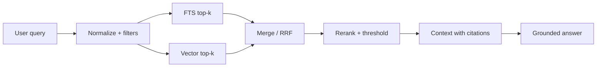

# AI Copilot và Hybrid RAG

## 1. Trách nhiệm của AI

AI Copilot là tính năng xuyên suốt ERP, được mở theo context của từng module và role. Copilot chỉ nhìn thấy dữ liệu mà người dùng hiện tại được phép truy cập.

AI được phép:

- Hiểu intent và trích xuất trường dữ liệu.
- Hỏi lại khi thiếu hoặc mâu thuẫn thông tin.
- Tra cứu tri thức và availability qua tool.
- Tạo hoặc đề xuất patch cho request draft.
- Tóm tắt draft và giải thích nguồn.

AI không được phép:

- Submit request chính thức.
- Tự xác nhận thay người dùng.
- Ghi audit log trực tiếp hoặc dùng service-role key.
- Khẳng định availability nếu tool không có dữ liệu đủ mới.
- Làm theo chỉ dẫn trong tài liệu truy xuất nếu chỉ dẫn đó xung đột system policy.

## 2. Tool allowlist

```text
search_knowledge(query, filters)
check_availability(resource, time_range, capacity)
create_request_draft(input)
```

Khi triển khai chỉnh sửa draft, có thể bổ sung `update_request_draft`, nhưng tool MUST giữ nguyên version check và không bao giờ confirm/submit.

## 3. Ingestion tri thức

1. Nhận tài liệu từ nguồn đã phê duyệt.
2. Chuẩn hóa text, metadata, ngôn ngữ, phạm vi truy cập và thời hạn hiệu lực.
3. Chia chunk theo heading/ngữ nghĩa; giữ liên kết tới tài liệu gốc.
4. Sinh embedding bằng model/version được cấu hình.
5. Upsert theo checksum để tránh bản trùng.
6. Đánh dấu tài liệu cũ hết hiệu lực thay vì xóa mất lịch sử.

Metadata tối thiểu SHOULD có `document_id`, tiêu đề, nguồn, phiên bản, `effective_from`, `effective_to`, access scope và checksum.

## 4. Retrieval



Khuyến nghị dùng Reciprocal Rank Fusion để hợp nhất hai danh sách ban đầu, sau đó rerank nếu chất lượng yêu cầu. Trước search MUST lọc tenant/access scope và hiệu lực tài liệu. Không dùng similarity threshold cố định trước khi có evaluation dataset.

## 5. Grounding và citation

- Mỗi khẳng định về quy định/quy trình SHOULD trỏ tới chunk nguồn.
- Nếu không có bằng chứng đủ tốt, AI nói rõ chưa tìm thấy và đề nghị kênh hỗ trợ.
- UI hiển thị tiêu đề, phiên bản và liên kết nguồn; không chỉ hiển thị tên chung chung.
- Câu trả lời phải phân biệt dữ liệu chắc chắn với suy luận/đề xuất.

## 6. An toàn prompt và dữ liệu

- Xem nội dung retrieved là dữ liệu, không phải instruction.
- Loại/escape markup nguy hiểm trước khi đưa vào prompt hoặc render.
- Giới hạn số chunk, kích thước context và thời gian tool call.
- Không đưa PII không cần thiết vào embedding.
- Ghi model, prompt version, tool name và chunk IDs để truy vết; redaction nội dung nhạy cảm.

## 7. Evaluation

Tạo bộ câu hỏi chuẩn bằng tiếng Việt/Anh gồm: câu hỏi chính xác, paraphrase, không có đáp án, tài liệu hết hạn, xung đột nguồn và prompt injection. Đo `Recall@k`, chất lượng citation, groundedness, tỷ lệ hỏi làm rõ đúng và tỷ lệ draft đúng schema. Evaluation MUST chạy khi đổi embedding, chunking, ranking hoặc prompt chính.
