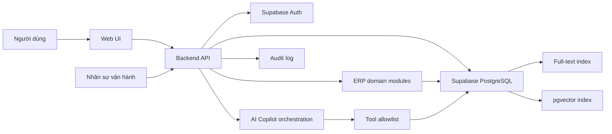

# Kiến trúc NIC Operations ERP

## 1. Tổng quan

## 2. Thành phần

### Web UI

- Cung cấp ERP shell, dashboard, navigation và workspace theo capability/role.
- Cung cấp các màn hình nghiệp vụ cho facility, asset, event, booking, request và workflow.
- Hiển thị hội thoại, citation và draft có cấu trúc.
- Cho phép người dùng sửa các trường draft.
- Hiển thị rõ trạng thái `draft`, `confirmed`, `submitted`.
- Gửi thao tác confirm/submit bằng session đã xác thực.
- Không được coi state phía client là bằng chứng authorization.

### Backend API

- Xác thực JWT/session và lấy `actor_id` từ token, không từ request body.
- Resolve role, department, organization scope và record relationship.
- Validate input bằng schema cố định.
- Điều phối AI và chỉ cấp tool trong allowlist.
- Thực hiện confirm và submit bằng transaction hoặc database function an toàn.
- Ghi audit đồng thời với thay đổi nghiệp vụ.

### AI orchestration

- Nhận message và context tối thiểu cần thiết.
- Phân loại intent, hỏi làm rõ và tạo structured output.
- Không nắm service-role key và không gọi submit endpoint.
- Tool output là dữ liệu không đáng tin cậy và phải được validate.

### ERP domain modules

- Tổ chức theo modular monolith với ranh giới domain rõ ràng.
- Mỗi module sở hữu entity, use case, permission, state transition và audit event.
- Giao tiếp qua application services thay vì component/UI truy cập bảng trực tiếp.

### PostgreSQL/Supabase

- Lưu draft, request chính thức, knowledge chunks và audit log.
- Thực thi RLS như lớp phòng vệ dữ liệu.
- Cung cấp FTS và vector search trong cùng hệ quản trị.

## 3. Trust boundaries

| Biên | Quy tắc |
|---|---|
| Browser → Backend | Mọi input đều không tin cậy; bắt buộc auth, validation, rate limit |
| Backend → AI | Chỉ gửi dữ liệu cần thiết; không gửi secret hoặc dữ liệu vượt quyền |
| AI → Tool | Tool allowlist, schema validation, timeout và giới hạn kết quả |
| Backend → Database | Dùng user context cho thao tác người dùng; service role chỉ ở backend cần thiết |
| Operator → System | RBAC riêng; mọi thay đổi trạng thái phải audit |

## 4. Trạng thái hiện tại và kiến trúc mục tiêu

| Năng lực | Hiện tại | Mục tiêu |
|---|---|---|
| ERP UI | Chưa có; UI hiện tại là prototype Copilot | ERP shell và layout theo role |
| Identity/authorization | Chưa tích hợp | Auth + RBAC/ABAC + RLS + access review |
| ERP domain | Chưa có | Facility, Asset, Event, Booking, Request, Workflow |
| UI draft/confirm | Mock state trong React | Dữ liệu thật theo session trong Copilot/module |
| Domain policy | Hàm TypeScript + unit test | Enforcement tại API và database transaction |
| Database | Migration ban đầu | Bổ sung requests, events và search RPC |
| RAG | Schema/index | Ingestion, retrieval, rerank, citation |
| Authentication | Chưa tích hợp | Supabase Auth + protected routes |
| Audit | Bảng và revoke | Ghi append-only từ backend/database |
| Observability | Chưa có | Structured logs, metrics, tracing, alerts |

## 5. Nguyên tắc triển khai

- Tách UI, domain policy, application service và persistence.
- Idempotency key cho submit để retry không tạo request trùng.
- Optimistic concurrency bằng `version`; update MUST kiểm tra phiên bản mong đợi.
- Không log prompt/payload nhạy cảm mặc định; redaction trước khi ghi log.
- Secret chỉ ở server runtime và secret manager của môi trường deploy.
