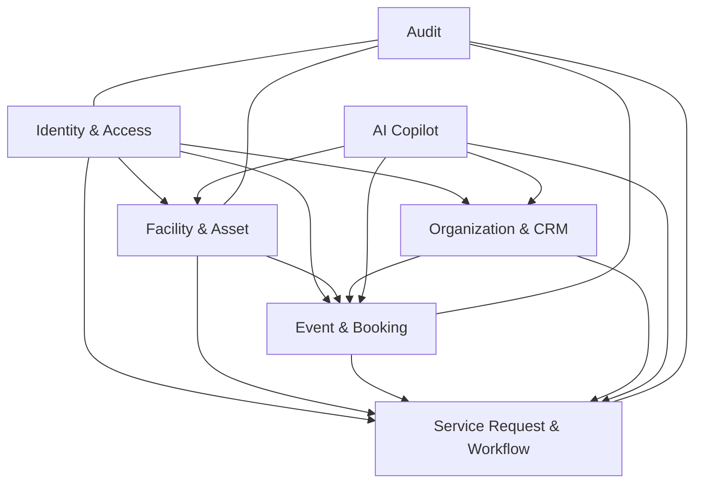

# Mô hình sản phẩm ERP

## 1. Định vị sản phẩm

NIC Operations ERP là hệ thống quản trị vận hành doanh nghiệp. Chatbot hiện tại chỉ là prototype của phân hệ **AI Copilot**, không phải trang chủ hay lõi hệ thống.

Các nguyên tắc bắt buộc:

- Nghiệp vụ và dữ liệu ERP là nguồn sự thật; AI chỉ tương tác qua service/API được cấp quyền.
- Mỗi phân hệ có ownership, state machine, permission và audit riêng.
- Dashboard và điều hướng thay đổi theo role; quyền backend không phụ thuộc việc menu có hiển thị hay không.
- Không xây microservices sớm. Giai đoạn đầu dùng modular monolith với ranh giới domain rõ ràng trên cùng PostgreSQL.

## 2. Các phân hệ

| Phân hệ | Chức năng chính | Đơn vị sở hữu nghiệp vụ |
|---|---|---|
| Organization & CRM | Doanh nghiệp, đơn vị, liên hệ, membership | Ban quản trị/CSKH |
| Facility | Cơ sở, tòa nhà, tầng, phòng, sức chứa, tiện ích | Phòng Cơ sở vật chất |
| Asset & Maintenance | Tài sản, thiết bị, bảo trì, sự cố | Phòng Cơ sở vật chất |
| Event Management | Sự kiện, khách, dịch vụ, lịch và checklist | Phòng Sự kiện |
| Booking | Đặt phòng/tài nguyên, xung đột lịch | Sự kiện + Cơ sở vật chất |
| Service Request | Yêu cầu hỗ trợ, phân công, SLA, trao đổi | Bộ phận tiếp nhận + đơn vị xử lý |
| Task & Workflow | Công việc, phê duyệt, escalation | Theo từng quy trình |
| Knowledge | Quy trình, chính sách, hướng dẫn có phiên bản | Đơn vị ban hành nội dung |
| Reporting | KPI, utilization, SLA, workload | Ban lãnh đạo và trưởng đơn vị |
| Identity & Administration | User, role, department, scope, cấu hình | Quản trị hệ thống |
| Audit & Compliance | Nhật ký bảo mật/nghiệp vụ, truy xuất | Kiểm soát nội bộ |
| AI Copilot | Tìm kiếm, hỏi đáp, tạo draft, tóm tắt | Nền tảng dùng chung |

## 3. Ranh giới domain



AI Copilot không truy cập trực tiếp bảng dữ liệu. Copilot gọi application services, và application services luôn áp dụng quyền của người dùng đang đăng nhập.

## 4. Cấu trúc ứng dụng mục tiêu

```text
/app
  /(auth)                 đăng nhập, khôi phục tài khoản
  /(erp)                  ERP shell sau đăng nhập
    /dashboard
    /organizations
    /facilities
    /assets
    /maintenance
    /events
    /bookings
    /requests
    /tasks
    /reports
    /knowledge
    /administration
  /api                    backend routes
/modules
  /identity
  /organization
  /facility
  /event
  /service-request
  /workflow
  /knowledge
  /copilot
  /audit
```

Đây là cấu trúc mục tiêu, chưa phải cấu trúc mã nguồn hiện tại.

## 5. Entity nền tảng

- `organizations`, `departments`, `users`, `memberships`.
- `roles`, `permissions`, `role_permissions`, `user_role_assignments`.
- `sites`, `buildings`, `floors`, `spaces`.
- `assets`, `maintenance_plans`, `maintenance_jobs`.
- `events`, `event_attendees`, `event_services`, `bookings`.
- `service_requests`, `request_assignments`, `tasks`.
- `approval_flows`, `approval_steps`, `status_events`.
- `knowledge_documents`, `knowledge_chunks`.
- `notifications`, `audit_logs`, `idempotency_keys`.

## 6. Lộ trình triển khai

1. **ERP foundation:** authentication, organization, department, RBAC/ABAC, ERP shell, audit.
2. **Facility foundation:** location, space, asset, availability.
3. **Operational workflows:** event, booking, service request, task, SLA, approval.
4. **Reporting:** dashboard, KPI và export theo scope.
5. **AI Copilot:** RAG và draft actions dựa trên các service đã ổn định.

Không mở rộng Copilot sang side effect mới trước khi domain API, permission và audit của nghiệp vụ tương ứng hoàn tất.

