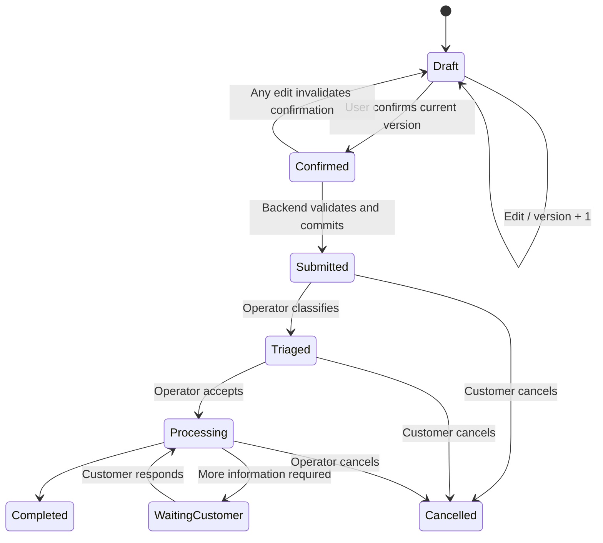

# Luồng request và API

## 1. State machine



`confirmed` nên được suy ra từ `confirmed_version === version`, không cần là một trạng thái database độc lập.

## 2. Invariants bắt buộc

- Draft thuộc về đúng `auth.uid()`.
- Chỉ draft có `status = draft` mới được sửa hoặc submit.
- Mỗi lần sửa tăng `version` và đặt `confirmed_version = null`.
- Confirm chỉ áp dụng cho version người dùng đang nhìn thấy.
- Submit chỉ thành công khi `confirmed_version = version`.
- Submit tạo request chính thức và audit log trong cùng transaction.
- Request đã submit không được sửa qua API draft.
- Customer chỉ tự hủy request ở trạng thái `submitted` hoặc `triaged`; khi fulfillment đã bắt đầu, backend từ chối hủy với conflict ổn định.
- Comment chỉ được tạo bởi actor có quyền đọc request theo owner, organization hoặc assigned team; request `cancelled` không nhận comment mới.
- Comment, hủy và đánh dấu notification đều lấy actor từ session, yêu cầu CSRF, rate limit khi phù hợp và ghi audit.

## 3. API mục tiêu

Tên route có thể thay đổi khi triển khai; semantics và guardrail không được thay đổi.

| Method | Route | Mục đích |
|---|---|---|
| POST | `/api/concierge/messages` | Gửi message, nhận reply/citation và draft patch |
| POST | `/api/request-drafts` | Tạo draft mới |
| GET | `/api/request-drafts/:id` | Đọc draft thuộc user |
| PATCH | `/api/request-drafts/:id` | Sửa với `expectedVersion` |
| POST | `/api/request-drafts/:id/confirm` | Xác nhận version hiện tại |
| POST | `/api/request-drafts/:id/submit` | Backend validate và submit |
| GET | `/api/requests` | Danh sách request của user |
| GET | `/api/requests/:id` | Chi tiết, trao đổi, timeline và quyền hành động theo scope |
| POST | `/api/requests/:id` | Thêm trao đổi hoặc hủy request theo policy |
| GET/POST | `/api/notifications` | Đọc notification của chính user; đánh dấu từng mục hoặc tất cả đã đọc |

## 4. Submit transaction

Pseudo-flow phía server:

```text
authenticate request
derive actor_id from session
validate route params, body and idempotency key
begin transaction
  select draft for update
  assert owner_id = actor_id
  assert status = draft
  assert confirmed_version = version
  validate payload against request_type schema
  re-check time-sensitive constraints/availability
  insert official request
  mark draft submitted
  insert audit log without secrets
commit
return request id and status
```

Nếu bất kỳ bước nào thất bại, transaction rollback. Response lỗi SHOULD dùng mã ổn định như `AUTH_REQUIRED`, `VERSION_CONFLICT`, `CONFIRMATION_REQUIRED`, `VALIDATION_FAILED` hoặc `AVAILABILITY_CHANGED`.

## 5. Chống race condition và submit trùng

- `PATCH` nhận `expectedVersion`; database update chỉ thành công nếu version khớp.
- Submit khóa row hoặc dùng stored function atomic.
- Client gửi `Idempotency-Key`; backend lưu key cùng kết quả trong một khoảng retention.
- Nếu availability thay đổi sau xác nhận, không tự thay draft và submit; trả về conflict để người dùng duyệt lại.

## 6. Phân quyền

- User: CRUD draft của mình, confirm/submit draft của mình, đọc request của mình.
- Operator: đọc request trong phạm vi được giao và cập nhật trạng thái hợp lệ.
- Admin: quản trị knowledge/role theo tenant.
- AI: không phải database role nghiệp vụ; chỉ hành động thông qua backend tools bị giới hạn.
